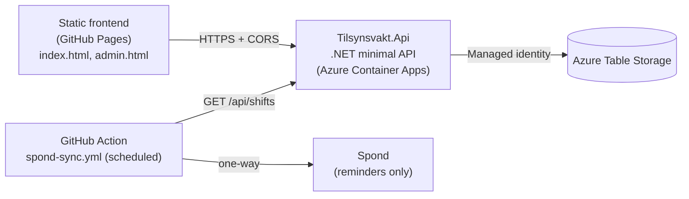

# Tilsynsvakt – Tasta skole gymsal

Handbook, roster and sign-up site for *tilsynsvakter* (guards) in the gym hall at Tasta skole. The guard holds the keys and makes sure the gym hall is used responsibly. The scheme is run by Tasta skolekorps.

The repo contains:

- a static, mobile-first frontend (GitHub Pages) used on a phone in the hallway by the gym hall,
- a .NET minimal API that is the source of truth for the guard roster,
- a one-way sync tool that pushes the roster to Spond for reminders.

## Architecture



- **Frontend:** plain HTML/CSS/JS, no build step. Static data (usage plan, contacts, guard names) lives in `data/*.json`. A service worker (`sw.js`) caches the app shell and static data.
- **Backend:** .NET 10 minimal API orchestrated with Aspire 13.6. Persists guards and shifts in Azure Table Storage via `Azure.Data.Tables` (one table, default name `Tilsynsvakt`). Locally, Aspire runs the Azurite Tables emulator; in Azure Container Apps the API uses its managed identity.
- **Spond sync:** Spond has no official public API and is never called from the browser or the API. A scheduled GitHub Action runs `src/Tilsynsvakt.SpondSync`, reads the roster from the API and syncs it one way to Spond. See [src/Tilsynsvakt.SpondSync/README.md](src/Tilsynsvakt.SpondSync/README.md).
- **Trust-based:** no authentication for guards. A guard selects their name (selection, not login) and anyone can sign up for or change any shift. Only the admin endpoints are protected.

## Repo layout

| Path | Contents |
|------|----------|
| `index.html`, `styles.css`, `js/app.js` | Guard site: today's plan, roster/sign-up, contacts, checklist, incident form |
| `admin.html`, `js/admin.js` | Admin page: duty summary and guard/duty management (uses the admin API) |
| `config.js` | Runtime config: `window.TILSYNSVAKT_CONFIG = { apiBaseUrl: "..." }` |
| `sw.js` | Service worker (offline cache) |
| `data/` | Static JSON: `usage-plan.json`, `contacts.json`, `guards.json`, `roster-import.json` |
| `src/Tilsynsvakt.Api/` | Minimal API, Table Storage stores, validation, ProblemDetails errors |
| `src/Tilsynsvakt.AppHost/` | Aspire AppHost (API + Azurite locally, Azure Container Apps on publish) |
| `src/Tilsynsvakt.ServiceDefaults/` | Aspire service defaults (health checks, telemetry) |
| `src/Tilsynsvakt.SpondSync/` | Console tool for the one-way Spond sync |
| `scripts/import-roster.ps1` | Imports `data/guards.json` and `data/roster-import.json` through the admin API |
| `tests/Tilsynsvakt.Api.Tests/` | API tests (in-memory stores) and opt-in Azurite contract tests |
| `tests/Tilsynsvakt.SpondSync.Tests/` | Spond sync planner/contract tests |
| `tests/admin.test.cjs` | Playwright UI test for `admin.html` |
| `Tilsynsvakt.slnx`, `aspire.config.json` | Solution file and Aspire CLI AppHost pointer |

## API

All routes are under `/api`. Errors are RFC 9457 ProblemDetails with Norwegian `title`/`detail` and a stable `code`.

| Method | Route | Purpose |
|--------|-------|---------|
| GET | `/api/guards` | Active guards |
| GET | `/api/shifts?from=&to=` | Shifts in a date range (open/taken) |
| GET | `/api/shifts/{date}` | One shift |
| POST | `/api/shifts/{date}/signup` | Sign up for a shift |
| PUT | `/api/shifts/{date}` | Replace the guard on a shift (optimistic concurrency via `expectedGuardId`) |
| DELETE | `/api/shifts/{date}` | Cancel a shift |
| PUT / DELETE | `/api/shifts/{date}/signoff` | Record / undo sign-off for a shift |
| GET / POST | `/api/swap-requests` | List pending / create swap requests |
| POST | `/api/swap-requests/{date}/{targetDate}/accept` | Accept a swap |
| DELETE | `/api/swap-requests/{date}/{targetDate}` | Withdraw a swap |
| GET / POST | `/api/admin/guards` | Admin: list / create guards |
| PUT / DELETE | `/api/admin/guards/{id}` | Admin: update / deactivate a guard |
| GET | `/api/admin/duties` | Admin: duty list and totals |
| PUT | `/api/admin/duties/{date}` | Admin: upsert a duty |

Admin endpoints are only mapped when `Admin:ApiKey` or both `Admin:Username` and `Admin:Password` are configured. They accept `Authorization: Bearer <key>` or HTTP Basic, are rate limited and excluded from OpenAPI. Health endpoints come from ServiceDefaults (`/health`, `/alive`). OpenAPI is exposed with a Scalar API reference.

### Configuration keys

| Key | Purpose |
|-----|---------|
| `ConnectionStrings:tables` (or `TABLES_CONNECTIONSTRING`, `TABLES_TABLEENDPOINT`, `Storage:ConnectionString`, `Storage:TableServiceUri`) | Table Storage connection; Aspire supplies this via `WithReference(tables)` |
| `Storage:TableName` | Table name (default `Tilsynsvakt`) |
| `Storage:CreateTable` | Create the table on startup (`true` in Development and on ACA publish) |
| `Frontend:Origin` | The single allowed CORS origin (origin only, no path) |
| `Calendar:Periods`, `Calendar:Closed` | Shift periods (01.09–28.11, 05.01–29.05) and closed date ranges |
| `RateLimit:MutationsPerMinute`, `RateLimit:AdminPerMinute` | Per-IP rate limits (defaults 30 / 20) |
| `Admin:ApiKey`, `Admin:Username`, `Admin:Password` | Admin credentials – secrets, never in the repo |

## Getting started locally

### Prerequisites

- .NET 10 SDK (all projects target `net10.0`)
- Aspire CLI (AppHost uses `Aspire.AppHost.Sdk/13.6.0`)
- Docker (Aspire starts Azurite as a container for Table Storage)
- For the frontend: any static file server, e.g. Python (`python -m http.server`)
- For the admin UI test: Node.js and Playwright

### Run the backend

```powershell
aspire run
```

`aspire.config.json` points the Aspire CLI at `src/Tilsynsvakt.AppHost`. Alternatively:

```powershell
dotnet run --project src/Tilsynsvakt.AppHost
```

The AppHost starts a persistent Azurite container with a data volume, waits for it, then starts the API with `ASPNETCORE_ENVIRONMENT=Development`. Open the Aspire dashboard to find the API URL.

`appsettings.Development.json` contains a development-only admin username/password placeholder. Use .NET User Secrets for anything else; never commit real credentials.

### Serve the frontend

```powershell
python -m http.server 8080 --bind 127.0.0.1
```

Then open `http://127.0.0.1:8080/` (guard site) or `http://127.0.0.1:8080/admin.html` (admin).

`config.js` sets `window.TILSYNSVAKT_CONFIG.apiBaseUrl`, which both `js/app.js` and `js/admin.js` use for every API call. The committed value points at the deployed API. To use a local API, change `apiBaseUrl` locally (don't commit it) and make sure the API's `Frontend:Origin` matches the frontend origin, otherwise CORS blocks the requests.

### Import guards and roster

```powershell
$env:TILSYNSVAKT_API_URL = "https://<backend>"
$env:TILSYNSVAKT_ADMIN_KEY = "<admin key>"
./scripts/import-roster.ps1 -WhatIf
```

The script reads the admin key from the environment only. Past shifts are skipped.

## Tests

```powershell
dotnet test Tilsynsvakt.slnx
```

- API tests use in-memory stores and need no external services.
- Azurite contract tests for the real `TableStores` are skipped unless `TILSYNSVAKT_AZURITE=1` and Azurite is running on the default ports (`UseDevelopmentStorage=true`).

Admin UI test (Playwright, mocked admin API): run the VS Code task **admin-ui-test-run**. It installs Playwright into `%TEMP%\tilsynsvakt-pw` if missing, uses the installed Microsoft Edge as Chromium, serves the repo on `127.0.0.1:8080` and runs `node tests/admin.test.cjs`. Override the URL with `ADMIN_TEST_URL` if needed.

## CI, deployment and secrets

| Workflow | Trigger | What it does |
|----------|---------|--------------|
| `squad-ci.yml` | PRs to `dev`/`preview`/`main`/`insider`, pushes to `dev`/`insider` | `dotnet test Tilsynsvakt.slnx` |
| `squad-release.yml` | Push to `main`, manual | Tests, then `aspire deploy` to Azure Container Apps using Azure OIDC login |
| `spond-sync.yml` | Every 15 min (only acts 06:00–23:00 Europe/Oslo), manual | Runs `Tilsynsvakt.SpondSync` against the API; dry run unless explicitly disabled |

Secrets are only stored as **GitHub Actions Secrets** and in the **Azure Container Apps secret store** (Aspire publishes the admin parameters as ACA secrets). Never put secrets in the frontend or the repo – the frontend is public.

- Deploy (`production` environment): secrets `ADMIN_API_KEY`, `ADMIN_USERNAME`, `ADMIN_PASSWORD`; variables `AZURE_CLIENT_ID`, `AZURE_TENANT_ID`, `AZURE_SUBSCRIPTION_ID`, `AZURE_LOCATION`, `AZURE_RESOURCE_GROUP`, `FRONTEND_ORIGIN`.
- Spond sync: secrets `SPOND_USERNAME`, `SPOND_PASSWORD`; variables `API_BASE_URL`, `SPOND_SYNC_DRY_RUN`, `SPOND_SYNC_DATES`.

## Conventions

- Code, identifiers, comments and commit messages: English. All user-facing text (UI, labels, error messages, handbook): Norwegian bokmål.
- Dates as `dd.mm` / `dd.mm.yyyy`, times as `hh:mm`, time zone `Europe/Oslo`. The API uses ISO `yyyy-MM-dd`.
- Phone numbers are displayed as `924 23 946` and linked as `tel:+4792423946`; the API stores E.164.
- The backend is the master for the roster. Spond is reminder-only and never read back.
- Shift days: Monday is covered by board representatives, Tuesday–Thursday by band parents per the roster, Friday has no activity. The guard is responsible for the gym hall only, not *musikkaula*.
- Personal data is limited to what is approved: date, name and phone per shift, and the contacts in the usage plan.
- Never write door codes, key box codes or other access codes anywhere in the repo. In user-facing text, write «koden står i permen».
- The incident report form has no submission yet; delivery is not decided.

## Contact

Questions: Leif Bjarte Johansson, [924 23 946](tel:+4792423946), leif.bjarte@gmail.com.
